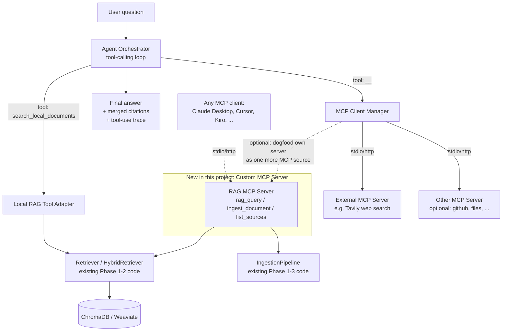
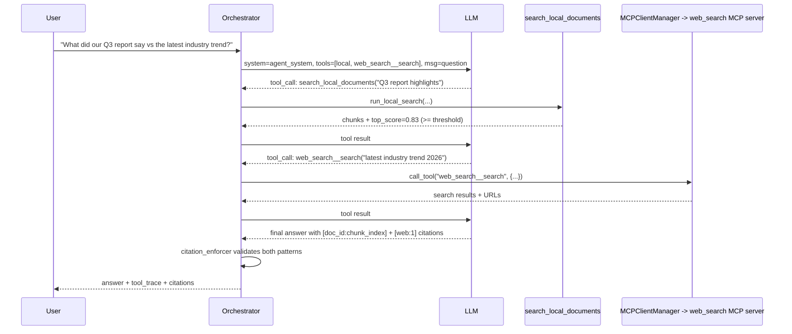

# Design — Agentic Multi-Source RAG + MCP

## 1. Goals / non-goals

**Goals:** multi-format ingestion; an LLM-driven decision layer that picks local RAG vs. one or
more MCP-connected external tools per question; a custom MCP server that exposes this project's
own RAG pipeline; all of it config-driven and additive to the existing Phase 1-3 code.

**Non-goals for this phase:** OCR for scanned PDFs (stub the hook, don't implement the model),
multi-agent/multi-hop planning beyond a bounded tool-call loop, a hosted/multi-tenant deployment
of the MCP server (single-process, single-user is fine), fine-tuning anything.

## 2. High-level architecture



Two things are easy to conflate, so to be explicit: the **Agent Orchestrator** is an MCP *client*
(it calls out to external MCP servers). The **RAG MCP Server** (Requirement 4) is a separate,
standalone MCP *server* this project exposes so other MCP clients — including, optionally, this
project's own orchestrator — can reach the RAG pipeline over the protocol instead of only via a
Python import. They share the same underlying `Retriever`/`IngestionPipeline` code; nothing is
duplicated.

## 3. Repo layout changes

```
rag_pipeline/
├── config/
│   ├── phase4.yaml                 # NEW — extends phase2/3 schema
│   └── loader.py                   # EXTEND — new config sections (§5)
├── ingestion/
│   ├── parsers/                    # NEW package
│   │   ├── __init__.py
│   │   ├── base.py                 # ParsedDocument, BaseParser
│   │   ├── text_parser.py          # .txt / .md (today's behavior, formalized)
│   │   ├── pdf_parser.py           # .pdf via pypdf
│   │   ├── docx_parser.py          # .docx via python-docx
│   │   ├── latex_parser.py         # .tex via pylatexenc
│   │   └── registry.py             # extension + magic-byte -> parser lookup
│   └── pipeline.py                 # EXTEND — ingest_file/ingest_directory use registry
├── retrieval/
│   └── citation_enforcer.py        # EXTEND — accept mixed local/web citation patterns
├── agent/                          # NEW package (Requirement 2)
│   ├── __init__.py
│   ├── orchestrator.py             # AgenticRAGPipeline — the tool-calling loop
│   ├── tools.py                    # tool schemas + local RAG tool adapter
│   └── mcp_client.py               # MCPClientManager — connects to configured servers
├── mcp_server/                     # NEW package (Requirement 4)
│   ├── __init__.py
│   ├── server.py                   # FastMCP server: rag_query / ingest_document / list_sources
│   └── __main__.py                 # `python -m mcp_server` entrypoint
├── eval/
│   ├── dataset.jsonl               # EXTEND — optional "expected_source" field
│   └── scorer.py                   # EXTEND — tool-selection metric
├── main.py                         # EXTEND — new --agentic flag, unchanged otherwise
└── requirements.txt                 # EXTEND — see §9
```

## 4. Component design

### 4.1 Ingestion parsers (Requirement 1)

```python
# ingestion/parsers/base.py
@dataclass
class ParsedDocument:
    text: str
    source: str            # filename, matches today's `source` field
    metadata: dict          # format, page_count, etc.

class BaseParser:
    SUPPORTED_EXTENSIONS: tuple[str, ...] = ()

    def parse(self, path: Path) -> ParsedDocument: ...

    @classmethod
    def can_parse(cls, path: Path, sniffed_type: Optional[str] = None) -> bool: ...
```

- `registry.py` holds `EXTENSION_TO_PARSER: dict[str, type[BaseParser]]` plus
  `get_parser_for(path: Path) -> BaseParser`, which first checks the extension, then falls back to
  sniffing magic bytes (`filetype` package) when the extension is missing/wrong, then raises
  `UnsupportedFormatError` if nothing matches — callers catch this and skip-with-warning per
  Requirement 1.3.
- `PDFParser.parse()`: `pypdf.PdfReader`, concatenate `page.extract_text()` per page, join with
  `\n\n`, set `metadata["page_count"]`. If total extracted text is empty/whitespace, still return
  a `ParsedDocument` with empty text — the pipeline reports 0 chunks for it (Requirement 1.4)
  rather than treating it as an error.
- `DocxParser.parse()`: `python-docx`'s `Document(path)`, join `paragraph.text` for all
  paragraphs plus cell text from tables, in document order.
- `LatexParser.parse()`: `pylatexenc.latex2text.LatexNodes2Text().latex_to_text(raw_source)` to
  strip commands/braces/comments into prose. Config flag `keep_math` (default `False`) controls
  whether math environments are dropped or kept as a placeholder token — dropped by default since
  raw LaTeX math reads as noise to an embedding model.
- `TextParser.parse()`: today's `read_text(encoding="utf-8", errors="replace")`, unchanged
  behavior, just moved behind the same interface.
- **Seam with existing code:** every parser returns a `ParsedDocument`, which
  `ingest_file`/`ingest_directory` convert to the exact same
  `{"text":..., "source":..., "metadata":...}` dict shape the pipeline already accepts. The
  low-level `ingest_documents(List[dict])` method, `TokenChunker`, `BaseEmbedder`, and every
  vector store implementation are **untouched**.

`ingestion/pipeline.py` changes:

```python
def ingest_file(self, path: str, metadata: Optional[dict] = None) -> IngestionStats:
    parser = get_parser_for(Path(path))          # NEW
    parsed = parser.parse(Path(path))             # NEW
    merged_meta = {**parsed.metadata, **(metadata or {})}
    return self.ingest_documents([{
        "text": parsed.text, "source": parsed.source, "metadata": merged_meta,
    }])

def ingest_directory(self, directory: str, glob: str = "**/*") -> IngestionStats:  # default glob widened
    d = Path(directory)
    docs, skipped = [], []
    for p in d.glob(glob):
        if not p.is_file():
            continue
        try:
            parser = get_parser_for(p)
        except UnsupportedFormatError as e:
            skipped.append({"file": str(p), "reason": str(e)})
            continue
        parsed = parser.parse(p)
        docs.append({"text": parsed.text, "source": str(p.relative_to(d)),
                     "metadata": {**parsed.metadata, "filepath": str(p)}})
    stats = self.ingest_documents(docs)
    stats.skipped = skipped          # NEW field on IngestionStats, default []
    return stats
```

### 4.2 Agent Orchestrator (Requirement 2)

`agent/orchestrator.py` defines `AgenticRAGPipeline`, parallel to the existing `RAGPipeline` (it
does not replace it — Phase 1-3 code paths keep working per Requirement 7).

```python
class AgenticRAGPipeline:
    def __init__(self, retriever, mcp_manager: MCPClientManager, cfg: PipelineConfig): ...

    def answer(self, question: str, model: str = "gpt-4o-mini") -> AgenticAnswer:
        """
        1. Build the tool list: local `search_local_documents` + every tool
           MCPClientManager discovered from connected servers.
        2. Call the LLM with tools + the routing system prompt (§4.4).
        3. Loop: for each tool_call the model returns, execute it (local
           adapter or via MCPClientManager.call_tool), append the tool
           result to the conversation, call the LLM again.
        4. Stop when the model returns a final message with no further
           tool_calls, OR max_tool_iterations is hit (return best-effort
           answer + a note that the iteration cap was reached).
        5. Run citation enforcement (extended, §4.6) on the final answer.
        6. Return AgenticAnswer with the answer text, merged citations, and
           a tool_trace: [{tool, args, result_summary}, ...] per Req 2.7.
        """
```

`agent/tools.py` defines the local tool adapter and its JSON schema:

```python
LOCAL_SEARCH_TOOL_SCHEMA = {
    "name": "search_local_documents",
    "description": (
        "Search the user's own ingested documents (PDFs, Word docs, LaTeX, "
        "notes, etc). Use this first for anything that plausibly lives in "
        "the user's private corpus. Returns ranked chunks with citation IDs "
        "and similarity scores; a low top score means the corpus likely "
        "doesn't cover this question."
    ),
    "parameters": {"type": "object", "properties": {
        "query": {"type": "string"}}, "required": ["query"]},
}

def run_local_search(retriever, query: str) -> dict:
    result = retriever.retrieve(query)
    return {
        "chunks": [{"citation_id": c.citation_id, "source": c.source,
                     "score": c.score, "text": c.text} for c in result.chunks],
        "top_score": result.chunks[0].score if result.chunks else 0.0,
        "below_confidence_threshold": (
            (result.chunks[0].score if result.chunks else 0.0) < cfg.retrieval.score_threshold
        ),
    }
```

Returning `top_score`/`below_confidence_threshold` in the tool result — rather than only raw
chunks — is what lets the model itself notice low-confidence local retrieval and decide to reach
for an external tool next (Requirement 2.3), without the orchestrator hard-coding that branch.

### 4.3 MCP Client Manager (Requirement 3)

`agent/mcp_client.py`, built on the official `mcp` Python SDK:

```python
class MCPClientManager:
    def __init__(self, server_configs: list[MCPServerConfig]): ...

    async def connect_all(self) -> None:
        """Open a session per enabled server (stdio subprocess or
        streamable-HTTP), call list_tools() on each, and store tool specs
        namespaced as f"{server.name}__{tool.name}" to prevent collisions
        (Req 3.2)."""

    def get_tool_schemas(self) -> list[dict]:
        """Flattened list of every discovered tool across every connected
        server, converted into the same JSON-schema shape the local tool
        uses, ready to hand to the LLM alongside search_local_documents."""

    async def call_tool(self, namespaced_name: str, arguments: dict) -> dict:
        """Split back into (server, tool), route to that session's
        call_tool, wrap errors as a structured {"error": ...} result instead
        of raising (Req 3.4) so the orchestrator can feed the failure back
        to the model and let it decide what to do next."""
```

Server unreachable at startup → log a warning, mark that server's tools absent from the schema
list for this run rather than failing the whole orchestrator (a degraded-but-working system beats
one that won't start because a search provider's API key expired).

### 4.4 Decision policy

The routing behavior lives in the system prompt + the `top_score`/`below_confidence_threshold`
signal, not in orchestrator branching logic — this keeps `strategy: auto` genuinely
LLM-driven per Requirement 2.1, while `rag_only` / `rag_then_fallback` (Requirement 5.2) give an
operator a way to constrain it when they want deterministic behavior instead.

| Query characteristic | Expected routing |
|---|---|
| References "the document(s)", "my notes", "our report", named files already ingested | Local RAG only |
| Local RAG top score ≥ `score_threshold` and chunks look on-topic | Local RAG only, no external call |
| Local RAG returns empty or `below_confidence_threshold: true` | External tool (e.g. web search) |
| Current events, prices, "latest", dates after the corpus's known coverage | External tool, local RAG optional |
| Needs both grounding and freshness ("compare our Q3 numbers to this quarter's industry data") | Both, cited separately |
| Ambiguous | Local RAG first (cheap, private, already citation-enforced) before reaching externally |

`strategy: rag_then_fallback` implements the middle three rows deterministically: call local
search first always; only include external tool schemas in the LLM's second turn if
`below_confidence_threshold` came back true. `strategy: auto` gives the model every tool up front
and trusts the system-prompt policy above. `strategy: rag_only` never registers external tool
schemas at all — useful for fully offline/air-gapped runs.

### 4.5 Citation enforcement across sources

`retrieval/citation_enforcer.py`'s current regex, `\[([a-f0-9]{8}:\d+)\]`, only matches local
citations. Extend it to accept either pattern and track provenance:

```python
LOCAL_CITATION = r"\[([a-f0-9]{8}:\d+)\]"
WEB_CITATION   = r"\[web:(\d+)\]"
```

Validation rule for agentic answers: every claim needs a citation of *either* form; a web citation
is only valid if its index `n` appears in the tool trace's list of retrieved web sources (so the
model can't invent `[web:3]` when only one web result came back). On violation, the existing
retry mechanism (`on_violation: retry`, `max_retries`) fires unchanged — the retry prompt just
needs both citation forms mentioned instead of one.

### 4.6 Custom RAG MCP Server (Requirement 4)

`mcp_server/server.py`, built with `mcp.server.fastmcp.FastMCP` for minimal boilerplate:

```python
mcp = FastMCP("rag-pipeline")

@mcp.tool()
def rag_query(question: str, top_k: int | None = None) -> dict:
    """Answer a question using the ingested document corpus. Returns the
    answer text plus the citation list and retrieved chunks."""
    answer = bundle.rag.answer(question)
    return {"answer": answer.answer, "citations": answer.citations,
            "chunks": [c.to_dict() for c in answer.retrieved_chunks]}

@mcp.tool()
def ingest_document(path: str, metadata: dict | None = None) -> dict:
    """Ingest a document into the corpus. `path` must resolve inside the
    configured allow-listed root; traversal outside it is rejected."""
    safe_path = _resolve_within_allowlist(path)   # Req 4.4
    stats = ingestion.ingest_file(str(safe_path), metadata)
    return {"documents": stats.num_documents, "chunks": stats.num_chunks}

@mcp.tool()
def list_ingested_sources() -> list[dict]:
    """List sources currently in the vector store, for a client deciding
    whether something is already ingested before re-ingesting it."""
    ...

if __name__ == "__main__":
    mcp.run()   # stdio by default; mcp.run(transport="streamable-http") for remote use
```

`_resolve_within_allowlist` (Requirement 4.4): resolve the given path, `Path(path).resolve()`,
and reject unless it is relative to a configured `mcp_server.ingest_allowlist_root` — this is the
one place in the whole feature where a network-reachable component takes a filesystem path as
input, so it gets its own explicit test for `../../` traversal and symlink escape.

This server can run two ways, per Requirement 4.5: standalone (`python -m mcp_server`, for any
external MCP client), or as one more entry in this project's own `mcp.servers` config list so the
orchestrator can reach it exactly like any other MCP server (useful mainly for testing the
orchestrator's routing against a known-good local tool without importing Python objects directly).

## 5. Configuration schema — `config/phase4.yaml`

Extends `phase2.yaml`/`phase3.yaml` — same loader, new top-level sections:

```yaml
version: "4.0.0"

# ... chunking / embedding / vector_store / retrieval / citation_enforcement / prompts
# unchanged from phase2.yaml, inherited as-is ...

ingestion:
  parsers:
    enabled_formats: ["txt", "md", "pdf", "docx", "tex"]
    pdf:
      ocr_fallback: false          # stretch goal, off by default (Req 1.4)
    latex:
      keep_math: false

agent:
  enabled: true
  strategy: "auto"                 # auto | rag_only | rag_then_fallback
  max_tool_iterations: 4
  confidence_threshold: 0.75       # ties to retrieval.score_threshold if unset

mcp:
  servers:                         # servers this project's agent connects TO (client side)
    - name: "web_search"
      enabled: true
      transport: "stdio"
      command: "npx"
      args: ["-y", "tavily-mcp"]
      env:
        TAVILY_API_KEY: "${TAVILY_API_KEY}"
      tool_allowlist: ["search"]    # optional; omit to expose all discovered tools

  server:                          # this project's OWN server config (server side)
    transport: "stdio"             # or "streamable-http"
    http_port: 8765                # only used when transport is streamable-http
    ingest_allowlist_root: "./ingest_data"

prompts:
  agent_system: |
    You are a research assistant with two kinds of tools: local document
    search over the user's own ingested corpus, and external tools reached
    over MCP (e.g. web search). Prefer local search first — it's private
    and already citation-checked. Use an external tool when local search
    comes back empty, low-confidence, or the question needs current
    information the corpus can't have. You may use both and combine them.
    Cite local claims as [doc_id:chunk_index] and external claims as
    [web:n] with the source listed. If nothing supports a claim, say you
    don't know rather than guessing.
```

## 6. Sequence — one query in `auto` mode



## 7. Web-search MCP server: build vs. buy

The user's question was "what MCP server to use, how about building one of our own" — the answer
differs by which half of the system it's for:

- **Web search → use an existing MCP server, don't build one.** Web search infrastructure
  (crawling/index/ranking) is commodity and not this project's value-add. As of mid-2026:
  **Tavily** is the common default for agent/RAG use specifically because it returns
  citation-ready, pre-synthesized results rather than raw SERP links, which is exactly the shape
  this project's citation enforcement already expects. **Brave Search** is the privacy-first
  alternative (independent index, no Google/Bing dependency) if that matters more than
  agent-tuned formatting. **Exa** is worth adding as a second, optional server for
  concept/discovery-style queries a keyword index misses. Keep whichever you pick behind the same
  `mcp.servers` config list, swappable without code changes (Requirement 3.1) — don't hard-code
  one vendor's client library.
- **RAG/local-document access → yes, build one of our own** (Requirement 4). This is the part
  that's actually specific to this project — your corpus, your chunking, your citation format —
  so it's the piece worth owning rather than depending on someone else's generic
  "documents" MCP server, which wouldn't know about your hybrid retrieval, reranking, or citation
  enforcement.

## 8. Security considerations

- The RAG MCP server's `ingest_document` tool is the one new network-reachable surface that
  accepts a filesystem path — allow-list + path resolution per §4.6, with an explicit test.
- API keys for MCP servers (e.g. `TAVILY_API_KEY`) are read from environment variables via
  `${VAR}` substitution in config, never committed to YAML directly — consistent with the
  existing `.env`/`OPENAI_API_KEY` pattern.
- Local document contents are not forwarded into external tool-call arguments unless the query
  text itself requires it (Requirement 3.5) — the model composes the web search query, it isn't
  handed the raw local chunk text to relay outward.
- MCP server startup failures (missing API key, unreachable process) degrade to "that server's
  tools are simply unavailable this run," logged once, not a crash (§4.3).

## 9. New dependencies

```
mcp>=1.2.0                 # official MCP Python SDK — client + FastMCP server
pypdf>=4.2.0                # PDF text extraction
python-docx>=1.1.0          # Word text extraction
pylatexenc>=2.10            # LaTeX -> plain text
filetype>=1.2.0             # magic-byte sniffing fallback for parser registry
```

All four are additive; nothing already in `requirements.txt` is removed or version-bumped.
Per Requirement 7.3, `ingestion/parsers/registry.py` should raise a clear `ImportError`-derived
message (not a bare traceback) if a specific parser's dependency is missing, and only for the
format actually requested — `.txt`/`.md` ingestion has zero new dependencies and keeps working
even if none of the above are installed.

## 10. Testing strategy

- **Parsers:** one test per format using a small fixture file (`tests/fixtures/sample.pdf`,
  `.docx`, `.tex`), asserting extracted text contains known content and metadata fields are
  populated. A dedicated test for the "scanned PDF, no text layer" case (Requirement 1.4) and for
  "unsupported extension" (Requirement 1.3).
- **MCP client:** unit tests against a mock MCP server (the SDK ships a testing/in-memory
  transport) verifying tool namespacing, error wrapping on a simulated timeout, and graceful
  omission when a server is configured but unreachable.
- **Orchestrator:** unit tests with both tools mocked, covering: local-only path (high
  confidence, no external call made), fallback path (low confidence triggers external call),
  both-tools path, max-iteration cutoff, and citation-enforcement retry across mixed citation
  types.
- **MCP server:** an integration test that starts the server in-process (stdio), connects a real
  MCP client session to it, and calls all three tools end-to-end against a temp Chroma directory;
  a dedicated path-traversal rejection test for `ingest_document`.
- **Regression:** run the existing `tests/test_phase1.py` / `test_phase2.py` / `test_phase3.py`
  unmodified as a gate — Requirement 7.2.
